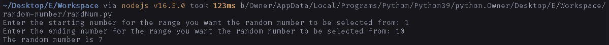
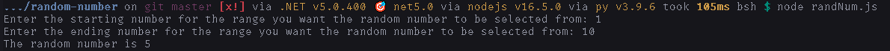

# How to run

The program is available in both python and javascript.

## Python

1. Install [python](https://python.org/downloads)
2. Download [`randNum.py`](https://raw.githubusercontent.com/DhruvMitna/ranom-number/master/randNum.py).
3. Open the donwloads folder and open `randNum.py`.

## Javascript

1. Install [node.js](https://nodejs.org/dist/v14.17.4/node-v14.17.4-x64.msi).
2. Download [`randNum.js`](https://raw.githubusercontent.com/DhruvMitna/random-number/master/randNum.js).
3. Press `win + r`.
4. Type `cmd` and press enter.
5. Type `cd Downloads` and press enter.
6. Type `node randNum.js and press enter.

### Examples

